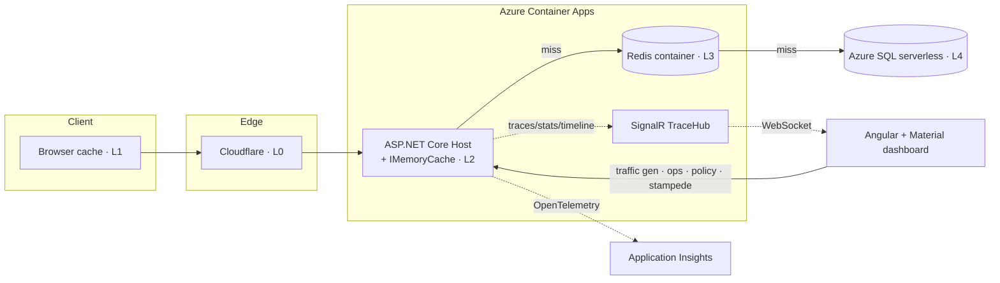

# CacheScope

**Enterprise Multi-Layer Cache Performance & Observability Platform**

CacheScope is a production-inspired platform-engineering tool that visualizes, analyzes,
and simulates the full lifecycle of a request as it travels through five caching layers.
It is **not** a CRUD app — its purpose is to make cache behavior *observable*: where every
request is served, how caching reduces latency and database load, and how the system
behaves under configurable synthetic traffic.

## Cache layers

| Layer | Component | Where it lives | Observed via |
|-------|-----------|----------------|--------------|
| **L0** | Cloudflare edge cache | Cloudflare POPs | `CF-Cache-Status` header, CF GraphQL analytics |
| **L1** | Browser cache | Client | `Cache-Control` / `ETag` response headers |
| **L2** | Application memory cache | In-process (`IMemoryCache`) | Server-side, directly measured |
| **L3** | Distributed cache | Self-hosted Redis container | Server-side, directly measured |
| **L4** | Database | Azure SQL (serverless, auto-pause) | Server-side, directly measured |

> L0 and L1 hits never reach the origin by definition, so they are **header-observed**
> rather than server-measured. L2–L4 are measured directly in the request pipeline.

## Architecture



A request checks each layer in order and is served by the first hit; misses cascade down and
populate the layers on the way back up (cache-aside). Every request emits a `RequestTrace`
(layer, latency, hit/miss, correlation id) that streams live to the dashboard.

## What's real vs. observed vs. simulated

Being precise about this, because it matters for interpreting the demo:

- **Measured directly (real):** L2 `IMemoryCache`, L3 Redis, and L4 SQL — every hit/miss and
  latency is recorded server-side in the pipeline.
- **Header-observed only:** L0 Cloudflare and L1 browser hits never reach the origin, so they
  are surfaced from `CF-Cache-Status` / `Cache-Control` headers, not measured. Server-side
  traffic generation exercises L2–L4; hitting L0/L1 requires real browser traffic through the CDN.
- **Optionally simulated:** database latency can be padded via `Database:SimulatedQueryLatencyMs`
  (default `0`). A warm local SQL answers in well under a millisecond, which hides the point of
  caching; a small pad makes the L2/L3-vs-L4 gap visible in demos. It's off unless you set it.

## Tech stack

- **Backend:** ASP.NET Core (targeting `net10.0`)
- **Frontend:** Angular + Angular Material *(Phase 2+)*
- **Realtime:** SignalR (self-hosted)
- **Distributed cache:** Redis (self-hosted container — no managed Redis cost)
- **Memory cache:** `IMemoryCache`
- **Database:** Azure SQL Database (serverless, auto-pause)
- **Edge/CDN:** Cloudflare (free plan)
- **Hosting:** Azure Container Apps (scale-to-zero)
- **Registry:** GitHub Container Registry (GHCR)
- **Telemetry:** OpenTelemetry → Application Insights

## Repository layout

```
Multi Layer Caching/
├── src/
│   ├── CacheScope.slnx
│   ├── Directory.Build.props        # solution-wide TFM + audit suppression
│   ├── Dockerfile                   # multi-stage build for the Host
│   ├── CacheScope.Host/             # web host + composition root (Program.cs, middleware)
│   ├── CacheScope.Api/              # API endpoints & contracts
│   ├── CacheScope.Shared/           # RequestTrace, CacheLayer, correlation constants
│   ├── CacheScope.MemoryCache/      # L2
│   ├── CacheScope.RedisCache/       # L3
│   ├── CacheScope.Cloudflare/       # L0 integration (CF API, header reading)
│   ├── CacheScope.Database/         # L4 (EF Core)
│   ├── CacheScope.Analytics/        # aggregation & metrics
│   ├── CacheScope.TrafficGenerator/ # load-generation engine
│   └── CacheScope.Realtime/         # SignalR hub
├── infra/
│   ├── main.bicep                   # full Azure topology
│   └── main.parameters.json
├── .github/workflows/deploy.yml     # build → GHCR → Container Apps
└── docker-compose.yml               # local dev: Redis + SQL + Host
```

## Running locally

Everything runs on your machine — Cloudflare (L0) and the browser cache (L1) only exist
in front of the public deployment.

```bash
# Option A — full stack in containers (Redis + SQL + Host)
docker compose up --build
# API on http://localhost:5199

# Option B — Host directly, bring your own Redis/SQL
cd src/CacheScope.Host
dotnet run
```

Then start the Angular dashboard (proxied CORS allows any localhost origin in dev):

```bash
cd web
npm install      # first time only
npm start        # ng serve on http://localhost:4200
```

Verify the Phase 0 pipeline:

```bash
curl -i http://localhost:5199/health
curl -i http://localhost:5199/diagnostics/echo
```

You should see an `X-Correlation-Id` on every response, and `/diagnostics/echo` echoing
the correlation id, the OpenTelemetry trace id, and any inbound `CF-Cache-Status`.

## Tests

Unit tests cover the load-bearing logic — the cache-aside/write-through orchestration, the
single-flight coalescer, streaming percentiles, the rolling stats, the Zipf/key selector, and
the cache policy:

```bash
dotnet test src/CacheScope.Tests
```

CI runs these on every push before building the image.

## Deploying to Azure

1. Provision infra once (helper script wraps the Bicep deployment):
   ```bash
   RG=cachescope-rg LOCATION=centralindia SQL_PW='<strong-pw>' \
   GHCR_USER='<github-user>' GHCR_TOKEN='<pat>' \
   IMAGE='ghcr.io/<user>/cachescope-host:latest' ./infra/deploy.sh
   ```
   Tear it all down (idle cost → ~0) with `RG=cachescope-rg ./infra/teardown.sh`.
2. Point your (name.com) domain's nameservers at Cloudflare, add a CNAME to the Container
   App FQDN, and enable the proxy + a cache rule.
3. Push to `main` — the GitHub Actions workflow builds, pushes to GHCR, and rolls out the
   new image.

## Build phases

- **Phase 0 — Foundations & cloud skeleton** ✅ *(this commit)*: solution structure,
  Shared trace models, correlation-id middleware, OpenTelemetry wiring, health +
  diagnostics endpoints, Docker/Compose, Bicep, CI/CD.
- **Phase 1 — cache pipeline** ✅: L2→L3→L4 cache-aside on `/api/products/{id}`, ETag/`Cache-Control`/304, `X-Served-By`, `RequestTrace` emission, DB queries-prevented metrics.
- **Phase 2 — realtime + UI** ✅: SignalR `TraceHub` streaming batched traces + rolling stats (channel-backed, drop-oldest backpressure), and an Angular + Material dashboard (`web/`) with a live stats panel, per-layer breakdown, a manual traffic burst, and a filterable live request stream.
- **Phase 3 — traffic generator** ✅: a real load-test engine — self-paced dispatch to a target RPS, bounded concurrency, 10 traffic patterns (Cold Start, Warm Cache, Steady, Burst, Hot Key, Random, **Zipf**, Cache Stampede, Bot, Mixed), key-selection strategies, GET/write split, per-pattern cache prep (flush/warm/expire/DB-resume). `POST /api/traffic/start|stop`, `GET /api/traffic/status`, live run status over SignalR, and a Traffic Generator UI + Live Traffic Panel in the dashboard. Generated requests flow through the same pipeline and appear in the live stream.
- **Phase 4 — analytics & charts** ✅: streaming latency percentiles (P50/P95/P99 via a fixed-bucket histogram — no per-tick sorting), a per-second metrics timeline, a Cloudflare `CF-Cache-Status` breakdown + edge hit ratio, DB queries executed/prevented/avg-time, `GET /api/analytics` + `POST /api/analytics/reset`, and a charts dashboard (distribution donut, hit-ratio gauge, per-layer bars, latency line, RPS area) that supports back-to-back pattern comparison.
- **Phase 5 — cache operations & policies** ✅: runtime-mutable policy (memory/Redis TTL, absolute vs sliding expiration) and all four write strategies — **Cache-Aside, Write-Through, Write-Behind** (background flusher), **Refresh-Ahead** (proactive reload near expiry) — switchable live via `PUT /api/policy`. Cache operations (`/api/cache/*`): clear/warm memory & Redis, expire/invalidate a product, flush everything, and Cloudflare edge purge (config-gated). Cache Operations & Policies UI panel.
- **Phase 6 — cache stampede demo** ✅: expire a hot key, fire N concurrent requests, and compare **no protection** (each miss hits the DB) against **single-flight** (concurrent misses coalesce into one DB load). `POST /api/stampede` + a side-by-side comparison panel. Verified: 1000 concurrent requests → **1000 DB queries unprotected vs 1 with single-flight**.
- **Phase 7 — observability deep-dive** ✅: per-request forensics — click any request in the live stream to see its per-layer timing waterfall, correlation id, and OpenTelemetry trace id. Each cache layer is its own span (`cache.memory` / `cache.redis` / `cache.database`) so the distributed trace mirrors the pipeline. `GET /api/traces/{correlationId}` + `/api/traces/recent`.
- **Phase 8 — hardening & polish** ✅: unit test suite (19 tests) run in CI before deploy, `infra/deploy.sh` + `infra/teardown.sh` for one-command provision/teardown (idle cost → ~0), architecture diagram, and the honesty section above.

## Cost

Designed to run within a GitHub Student Pack Azure credit at near-zero burn:
self-hosted Redis (no managed Redis), GHCR (no ACR), SQL serverless auto-pause, and
scale-to-zero Container Apps. The only out-of-pocket item is a domain (free via name.com
Student Pack).
